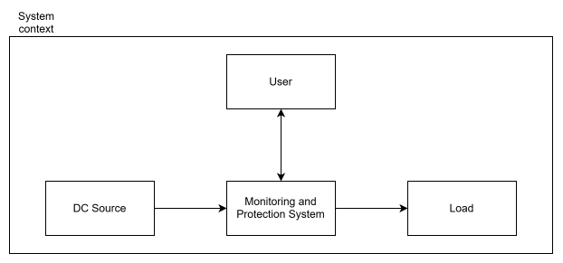
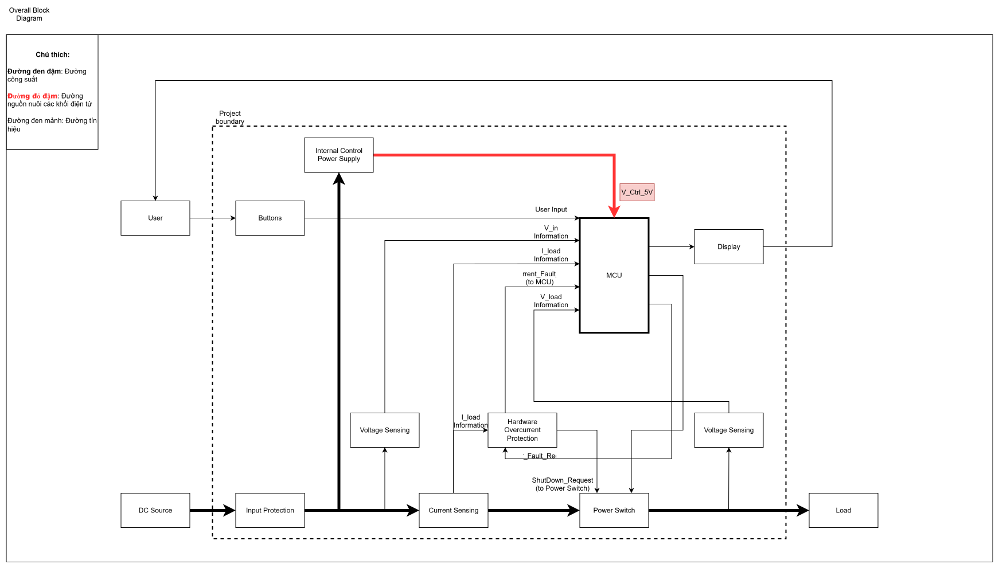
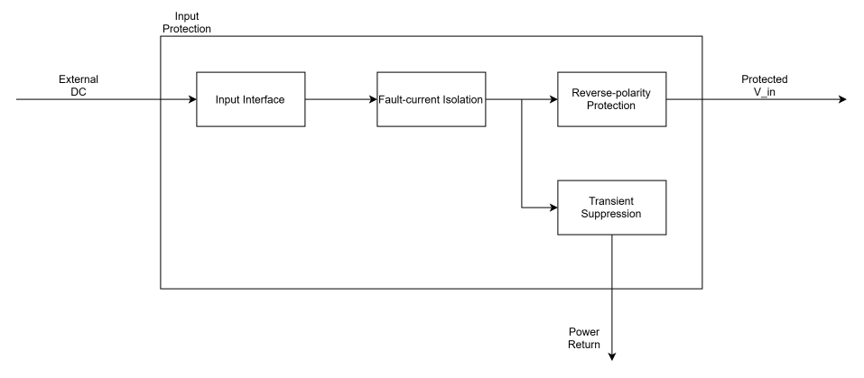
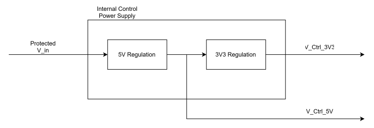
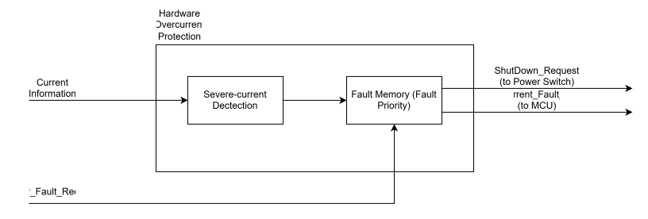
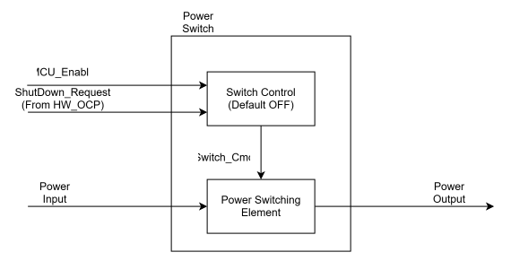
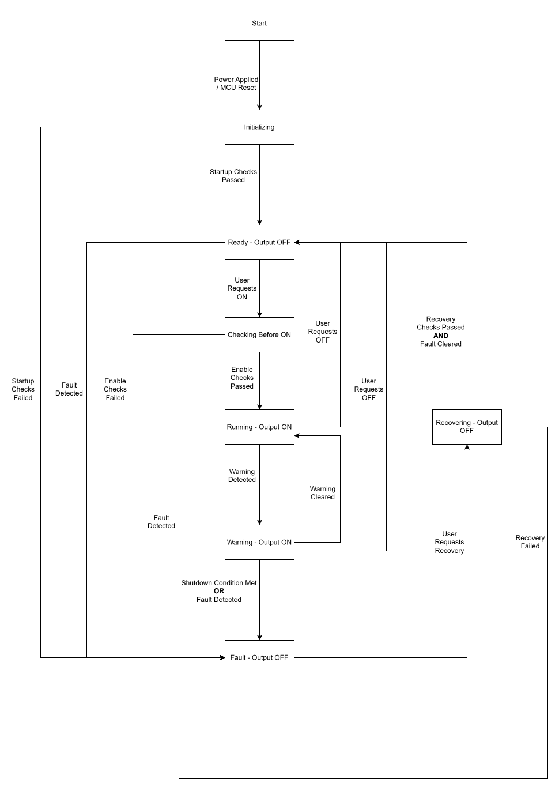

# Đặc tả thiết kế hệ thống

> Trạng thái: bản nháp kiến trúc chức năng v0.1, tổng hợp từ các sơ đồ của nhóm. Các thông số baseline trong Product Requirements vẫn giữ trạng thái tạm thời; tài liệu này chưa chốt linh kiện hoặc cách hiện thực phần cứng.

## 1. Phạm vi và biên hệ thống

Thiết bị nằm giữa nguồn DC ngoài và tải DC ngoài, giám sát đường công suất và có khả năng ngắt tải. Nguồn, tải và người dùng nằm ngoài biên hệ thống. Thiết bị không điều chỉnh điện áp công suất đầu ra thành một giá trị cố định.

Yêu cầu sản phẩm được mô tả tại [Product Requirements](product-requirements.md). Bản vẽ có thể chỉnh sửa nằm trong [system-architecture.drawio](diagrams/system-architecture.drawio); mỗi page tương ứng với một SVG được nhúng trong tài liệu này.

## 2. Kiến trúc tổng thể

Đường công suất đi qua Input Protection, Current Sensing và Power Switch trước khi đến tải. Nguồn điều khiển lấy từ nút sau Input Protection và trước Power Switch, nên việc ngắt tải không chủ động ngắt nguồn điều khiển. Nếu nguồn DC ngoài mất hoặc sụt dưới khả năng vận hành của nguồn nội bộ, hệ thống vẫn có thể mất nguồn.

Sơ đồ phân biệt đường công suất, đường nguồn nuôi điện tử và đường tín hiệu. Các đường cấp nguồn tới từng khối được lược bỏ để dễ đọc; việc phân phối rail cụ thể được xác định trong Hardware Specification.

Hai nút đo điện áp được định nghĩa trong kiến trúc hiện tại:

- `V_in`: sau Input Protection, trước Current Sensing và Power Switch.
- `V_load`: đầu ra hệ thống sau Power Switch, đo so với Power Return chung.

Khi đường công suất ON, `V_drop = V_in − V_load` phản ánh sụt áp giữa hai nút này. Khi switch OFF hoặc điện áp đang chuyển tiếp, không dùng hiệu điện áp đó để kết luận về tổn hao đường dẫn như khi hoạt động ổn định.

## 3. Các khối chức năng

### 3.1. Input Protection

Khối tiếp nhận nguồn ngoài, cô lập dòng sự cố, bảo vệ ngược cực và hạn chế xung điện áp. Đầu ra là `Protected V_in`, chưa phải điện áp được ổn áp. Transient Suppression là nhánh song song về Power Return. Thứ tự và topology linh kiện cụ thể, mức kẹp xung, giới hạn năng lượng và phương thức cô lập dòng được xác định khi thiết kế phần cứng.

Khối này bảo vệ đầu vào; bảo vệ quá dòng tải bằng phần cứng thuộc Hardware Overcurrent Protection, còn quản lý quá tải theo profile thuộc firmware.

### 3.2. Internal Control Power Supply

Khối nhận `Protected V_in`, tạo rail 5 V và từ đó tạo rail 3.3 V để cấp cho các khối điện tử. Sơ đồ mô tả chức năng regulation, chưa khóa công nghệ converter. Cách hiện thực phải xét điện áp thực tế sau tổn hao Input Protection trên toàn miền nguồn ngoài 5–15 V.

Hai interface nguồn là `V_CTRL_5V` và `V_CTRL_3V3`. Rail nào cấp cho MCU/module, display, sensing và protection còn phụ thuộc phần cứng được chọn. Tụ và bộ lọc cục bộ cần cho regulator thuộc thiết kế chi tiết của khối.

### 3.3. Current Sensing

Khối quan sát dòng `I_load` trên đường cấp tải và cung cấp thông tin dòng tới MCU và Hardware Overcurrent Protection. Đây là một output thông tin chức năng có hai consumer; chưa khẳng định số tín hiệu vật lý, định dạng analog/digital hoặc công nghệ cảm biến.

Khối cung cấp thông tin, không quyết định ngắt switch. Interface dành cho bảo vệ phải cho phép xử lý độc lập với firmware và đáp ứng yêu cầu phản ứng của đường bảo vệ. Không cần diagram con ở mức kiến trúc hiện tại.

### 3.4. Voltage Sensing

Hai kênh quan sát `V_in` và `V_load` cung cấp thông tin riêng tới MCU. Chúng lấy mẫu điện áp tại hai nút, không mắc nối tiếp để mang toàn bộ dòng tải. Phương pháp đo, scaling, filtering và loại interface được xác định trong Hardware Specification. Không cần diagram con cho hai kênh này.

### 3.5. Hardware Overcurrent Protection

Khối phát hiện quá dòng nghiêm trọng từ Current Information mà không chờ firmware. Fault Memory giữ trạng thái lỗi, phát yêu cầu shutdown tới Power Switch và báo trạng thái trực tiếp cho MCU.

Fault Priority nghĩa là khi điều kiện phát hiện lỗi và yêu cầu clear đồng thời tồn tại, trạng thái lỗi được giữ. Việc xóa lỗi chỉ giải phóng yêu cầu shutdown; không tự tạo yêu cầu enable tải.

Ngưỡng phát hiện, độ trễ, trạng thái latch khi mất nguồn và cơ chế khởi tạo lại được xác định ở đặc tả thành phần. Không giả định Fault Memory giữ dữ liệu sau khi mất nguồn.

### 3.6. Power Switch

Switch Control tiếp nhận yêu cầu enable từ MCU và yêu cầu shutdown từ bảo vệ phần cứng. Shutdown có quyền ưu tiên; Power Switching Element thực hiện đóng/ngắt công suất theo kết quả phân xử.

Yêu cầu fail-safe là mặc định OFF khi MCU reset, mất nguồn điều khiển hoặc chưa có yêu cầu enable hợp lệ. Cơ chế điện bảo đảm hành vi này sẽ được xác định trong Hardware Specification. Loại phần tử đóng/ngắt, dòng rò khi OFF, khả năng chặn dòng ngược và tổn hao khi ON chưa được chốt tại đây.

### 3.7. MCU và giao diện người dùng

MCU nhận thông tin đo, trạng thái lỗi phần cứng và thao tác người dùng. Firmware giám sát miền vận hành theo cấu hình/profile, quản lý trạng thái và phục hồi, phát yêu cầu enable/clear và cập nhật display. Firmware không thay thế đường bảo vệ quá dòng nghiêm trọng bằng phần cứng.

Buttons nhận thao tác chọn profile, điều khiển đầu ra và yêu cầu phục hồi. Display hiển thị `V_in`, `V_load`, `I_load`, trạng thái và nguyên nhân lỗi. UART phục vụ debug, kiểm thử và logging, không bắt buộc cho vận hành thông thường; buzzer không bắt buộc trong v0.1.

Không cần diagram con cho MCU, Buttons hoặc Display tại bước này. Phân rã firmware, state machine và luồng UI được mô tả trong Software Specification.

## 4. Interface chức năng

Tên chuẩn trong bảng dưới đây dùng để mô tả interface; các nhãn khác kiểu chữ trong bản vẽ hiện có được hiểu theo cùng ý nghĩa. Tên không quy định mức logic, cực tính hoặc chân linh kiện.

| Interface | Khối gửi | Khối nhận | Ý nghĩa |
| --- | --- | --- | --- |
| `V_IN_INFORMATION` | V_in Sensing | MCU | Thông tin điện áp đầu vào nội bộ |
| `V_LOAD_INFORMATION` | V_load Sensing | MCU | Thông tin điện áp đầu ra |
| `CURRENT_INFORMATION` | Current Sensing | MCU, HW Overcurrent Protection | Thông tin dòng tải; trong sơ đồ tổng thể ghi I_load Information |
| `MCU_ENABLE` | MCU | Power Switch | Yêu cầu đóng đường công suất |
| `SHUTDOWN_REQUEST` | HW Overcurrent Protection | Power Switch | Yêu cầu ngắt bắt buộc, ưu tiên hơn enable |
| `OVERCURRENT_FAULT_STATUS` | HW Overcurrent Protection | MCU | Trạng thái lỗi đã được giữ |
| `CLEAR_FAULT_REQUEST` | MCU | HW Overcurrent Protection | Yêu cầu xóa trạng thái lỗi |
| User Input | Buttons | MCU | Thao tác của người dùng |
| Display Information | MCU | Display | Giá trị đo, trạng thái và cảnh báo |
| `V_CTRL_5V`, `V_CTRL_3V3` | Internal Control Power Supply | Các khối cần nguồn | Rail nguồn điện tử; phân phối cụ thể TBD |

## 5. Trạng thái và hành vi hệ thống

### 5.1. State diagram

**Ghi chú:** Đầu ra chỉ được phép ON trong RUNNING và WARNING. Xử lý lỗi phải ngắt có ưu tiên cao hơn các chuyển trạng thái khác. MCU reset từ bất kỳ trạng thái nào đều đưa hệ thống về INITIALIZING với đầu ra OFF.

`Start` là điểm bắt đầu của sơ đồ, không phải một trạng thái vận hành. CHECKING BEFORE ON và RECOVERING thể hiện các bước xử lý có giữ đầu ra OFF.

| Trạng thái | Đầu ra | Ý nghĩa |
| --- | --- | --- |
| INITIALIZING | OFF | Khởi tạo và kiểm tra ban đầu sau cấp nguồn/reset |
| READY | OFF | Đủ điều kiện cho phép bật, chờ yêu cầu ON của người dùng |
| CHECKING BEFORE ON | OFF | Kiểm tra lại điều kiện tại thời điểm nhận yêu cầu ON |
| RUNNING | ON | Cấp điện và giám sát tải bình thường |
| WARNING | ON | Có cảnh báo nhưng chưa đạt điều kiện phải ngắt |
| FAULT | OFF | Giữ lỗi và chờ yêu cầu phục hồi thủ công |
| RECOVERING | OFF | Kiểm tra phục hồi và xử lý xóa lỗi |

### 5.2. Điều kiện chuyển trạng thái

| Từ | Điều kiện/sự kiện | Đến |
| --- | --- | --- |
| Điểm bắt đầu hoặc bất kỳ trạng thái nào | Cấp nguồn/MCU reset | INITIALIZING |
| INITIALIZING | Kiểm tra khởi động đạt | READY |
| INITIALIZING | Kiểm tra khởi động thất bại | FAULT |
| READY | Người dùng yêu cầu ON | CHECKING BEFORE ON |
| READY | Phát hiện lỗi | FAULT |
| CHECKING BEFORE ON | Kiểm tra cho phép bật đạt | RUNNING |
| CHECKING BEFORE ON | Kiểm tra cho phép bật thất bại do điều kiện lỗi | FAULT |
| RUNNING | Phát hiện cảnh báo | WARNING |
| RUNNING | Phát hiện lỗi phải ngắt | FAULT |
| WARNING | Hết cảnh báo và không có lỗi phải ngắt | RUNNING |
| WARNING | Đạt điều kiện phải ngắt hoặc phát hiện lỗi | FAULT |
| RUNNING hoặc WARNING | Người dùng yêu cầu OFF, không đồng thời có lỗi phải giữ | READY |
| FAULT | Người dùng yêu cầu phục hồi | RECOVERING |
| RECOVERING | Kiểm tra phục hồi đạt và lỗi đã được xóa thành công | READY |
| RECOVERING | Kiểm tra hoặc xóa lỗi thất bại | FAULT |

Nếu không có điều kiện chuyển hợp lệ, hệ thống giữ trạng thái hiện tại. Điều kiện cảnh báo kéo dài chỉ dẫn tới ngắt khi đạt tiêu chí tương ứng với loại lỗi/profile; không mặc định mọi cảnh báo có chung một timeout.

### 5.3. Giám sát, khởi động và yêu cầu ON/OFF

Khi nguồn điều khiển còn hoạt động, hệ thống tiếp tục giám sát V_in, V_load, I_load và trạng thái bảo vệ dù Power Switch ON hay OFF, đồng thời cung cấp trạng thái trên giao diện. Việc diễn giải thông tin đo phụ thuộc trạng thái switch.

Kiểm tra khởi động đánh giá điều kiện nguồn, V_in, tính hợp lệ của thông tin đo/cấu hình và trạng thái lỗi phần cứng. Khi đạt, hệ thống vào READY với đầu ra OFF, chờ người dùng yêu cầu ON; không tự khôi phục trạng thái ON trước reset.

Kiểm tra trước ON xác nhận lại điều kiện vận hành hiện tại và không có lỗi đang giữ. Chỉ khi đạt mới phát MCU_ENABLE. READY nghĩa là đủ điều kiện để thử cấp điện, chưa chứng minh tải không có sự cố. Profile có thể cho phép quá độ khởi động hợp lệ nhưng không được trì hoãn bảo vệ quá dòng nghiêm trọng.

Lệnh OFF của người dùng ngắt tải bình thường, không tự phát sinh FAULT và không xóa lỗi đang giữ. Lỗi do firmware hoặc hardware đều đưa hệ thống về OFF + FAULT. Với lỗi phần cứng, switch ngắt độc lập trước khi MCU tiếp nhận trạng thái và cập nhật giao diện.

### 5.4. Phục hồi và bật lại

1. Khi khởi động/reset, giữ Power Switch OFF cho đến khi có điều kiện và yêu cầu enable hợp lệ.
2. Khi bảo vệ phần cứng phát hiện quá dòng nghiêm trọng, Fault Memory giữ lỗi và SHUTDOWN_REQUEST ngắt switch độc lập với MCU.
3. MCU tiếp nhận OVERCURRENT_FAULT_STATUS, giữ MCU_ENABLE không hoạt động và hiển thị lỗi.
4. Không tự động retry. Người dùng phải yêu cầu phục hồi.
5. MCU giữ đầu ra OFF, thực hiện các kiểm tra phục hồi được định nghĩa và gửi CLEAR_FAULT_REQUEST khi hợp lệ.
6. MCU xác nhận trạng thái lỗi đã được xóa, đưa hệ thống về READY với đầu ra vẫn OFF. Người dùng phải gửi yêu cầu ON riêng để cấp điện lại.

Kiểm tra phục hồi quyết định có được xóa lỗi đang giữ hay không; kiểm tra trước ON quyết định có được cấp điện tại thời điểm nhận lệnh hay không. Hai bước có thể dùng chung kiểm tra điều kiện vận hành, nhưng phục hồi có thêm xử lý nguyên nhân lỗi và xóa trạng thái lỗi. Điều kiện phải được kiểm tra lại trước ON vì chúng có thể thay đổi sau khi phục hồi.

Khi tải đã ngắt, `I_load ≈ 0` không đủ chứng minh ngắn mạch đã được loại bỏ. Tiêu chí phục hồi, cách kiểm tra lỗi còn tồn tại và phản ứng nếu lỗi tái xuất hiện phải được xác định trước khi triển khai; không mặc định có thể kiểm tra mọi lỗi chỉ bằng phép đo khi OFF.

## 6. Các điểm cần hoàn thiện

- Sơ đồ tổng thể ghi `V_Ctrl_5V → MCU`: cần xác định khối MCU là module nhận 5 V hay chip dùng rail 3.3 V; chưa coi đây là quyết định cấp 5 V trực tiếp cho chip.
- Sửa lỗi chữ `Dectection` trong diagram bảo vệ và thống nhất tên tín hiệu giữa diagram tổng thể, diagram con và bảng interface.
- Chốt phần cứng, phương pháp sensing, dạng interface, mức logic, ngưỡng bảo vệ và timing ở đặc tả thành phần.
- Xác định tiêu chí phục hồi và hành vi khi nguồn nội bộ mất/sụt; trạng thái latch sau mất nguồn vẫn TBD, yêu cầu đầu ra mặc định OFF giữ nguyên.
- Chưa chốt việc bổ sung yêu cầu từ MCU để latch phần cứng giữ mọi lỗi firmware; không bổ sung interface này trong kiến trúc hiện tại.
- Đối chiếu vị trí đo V_in và các quyết định kiến trúc với Product Requirements trước khi chốt bản đặc tả để triển khai.

## 7. Quản lý bản vẽ

Chỉnh sửa trên file `.drawio`, sau đó xuất lại SVG của page tương ứng và đưa hai bản vào cùng thay đổi Git. SVG dùng để xem trên GitHub; `.drawio` là nguồn chỉnh sửa. Không cần xuất DOCX/PPTX vào repo.
